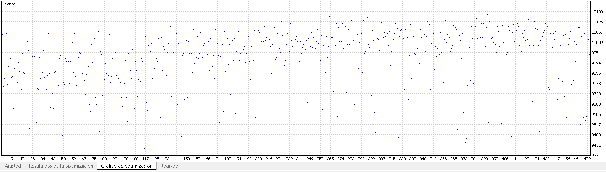
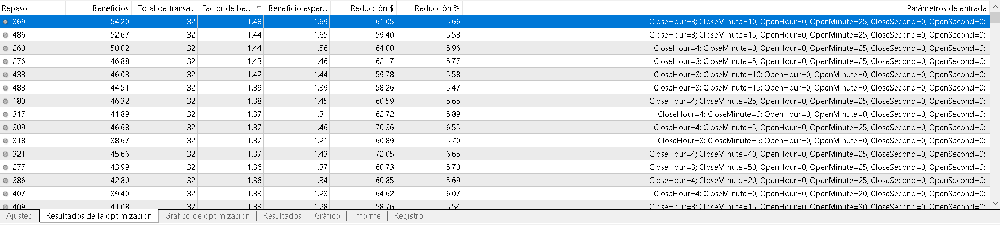
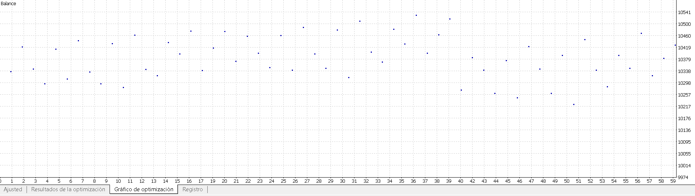
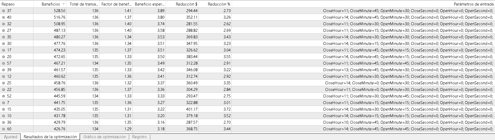
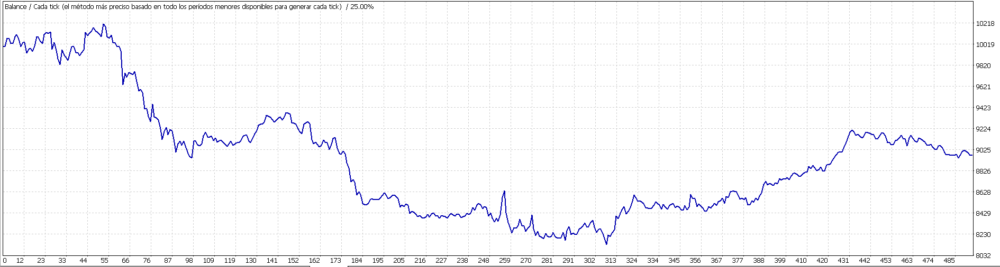
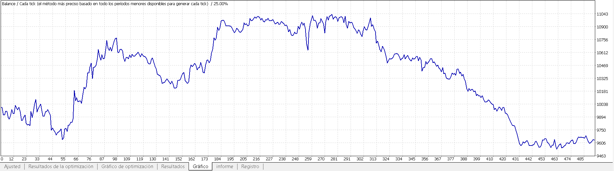
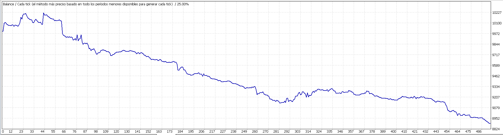
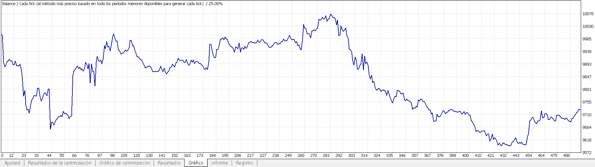

# EA_Swap

## Description
This automated investment strategy opens a position in a positive-swap forex pair before the end of wednesday session, and closes that position at the beginning of next session.

## Profit / Loss Theory
On the one hand, we have a loss caused by the spread and broker commission. 
We also have random probabilities of the price going against or in our favor during that small period of time.

On the other hand, we have a profit due to the triple rollover made on wednesday at 17:04:01 (New York time)

In conclusion, this EA is profitable if (3*swap > commission + spread) == true and variance is small enough.
If variance is too big, results will be random and not based on statistics and probability.

## Optimization and backtest
We'll be using the asset AUDCHF on M1 timeframe.
It's really important to make a lots of different tests to determine whether it is profitable or not and also (and really important) if results are random/luck or we really have a predictive power and statistic advantage.

### Round 1
We make a general optimization to get an idea of what is the best time to open and close the position.
We'll be backtesting from 2018/01/02 to 2019/08/09 (1 year and 8 months) using a lot of different variables' values combination. Estimated time: 2 hours and 40 minutes
We are going to optimize the following variables:
* OpenHour 
* OpenMinute 
* CloseHour 
* CloseMinute 
So, we open our position at "16 hours - OpenHour" and "59 min - OpenMinute" 
and we close that position at "17 hours + CloseHour" and "04 min + CloseMin".

Example:
If all the variables are set to 2, we'll open an order on wednesday at 14:57:00 and close it at 19:06:00 on the same day.

    
   

On that first basic optimization we see that if we buy at around 16:30-16:45 (15-30min before market closes) and we close the position at around 3-5am on the following day we'll have some positive results.
However, this is a not enough to determine wether this is a profitable strategy or not, so we'll have to go further in order to get reliable results.

### Round 2
We'll take the previous results to continue our market analysis and we'll do a backtest from 2018/01/02 to 2019/08/09 (1 year and 8 months)

    
   

We can observe that if we buy 0.1 lots of AUDCHF at 16:29 (New York time):

| Buy Time (Wednesday)  | Sell Time (Thursday) | Profit  | Drawdown | Profit Factor |
| ------------- | ------------- | ------------- | ------------- | ------------- |
| 16:29  | 04:49  | 528.50 (+5.3%)  | -2.73%  | 1.41  |
| 16:29  | 07:49  | 516.76 (+5.2%)  | -3.26%  | 1.37  |
| 16:29  | 04:34  | 508.95 (+5.1%)  | -2.62% | 1.4  |
| 16:29  | 04:19  | 487.13 (+4.9%)  | -2.69%  | 1.4  |
| 16:29  | 07:34  | 480.27 (+4.8%)  | -3.43%  | 1.34  |
| 16:29  | 07:19  | 477.76 (+4.8%)  | -3.23%  | 1.34  |

### Round 3 - Backtest 
We make a backtest from 2010/01/01 to 2019/08/09 (9 years and 8 months) using the following rules:
Buy AUDCHF at 16:29 on wednesday and sell it at 04:49 on thursday (always NY time)

    

Result:
We can't predict the market using this strategy as results are random. During all that time we have bear, lateral and bull results.
We had good results in the 2018-2019 backtest just because of luck, as the previous years were really bearish for our strategy.

What would happen if instead of buying, we make the inverse operation?
We could turn that losing performance into a winning one? 
Let's see it: Instead of buying, we will sell

    

### Round 4 - Backtest with different parameters
We make a backtest making simple rules:
Buy AUDCHF at 16:29 on wednesday and sell it at 17:49 on thursday (always NY time)

    

Results are even worse, as we only have bear and lateral results.

Instead of buying, we'll do the opposite. 
Let's see the results:

    

### Conclusion
I have discarded this EA because it's not profitable.
So, I make it open source to use it for my portfolio.
You see that I can code trading strategies, make backtests and optimizations to analyze about past performance and to determine wether we should operate that strategy or discard it.

## Disclaimer
This code is disclosed publicly for educational purposes only.
It is expected that this EA has a low scalability and may have divergence due to lower liquidity and bigger spreads in the foreign exchange markets at open/close times. There may also be differences between backtests/demo and live accounts due to slippage. The swap used in the backtest is the actual swap and not the historic one, so results can't be considered. 
Use at your own risk. I'm not responsible for any financial loss or damage caused by the use of this software.

