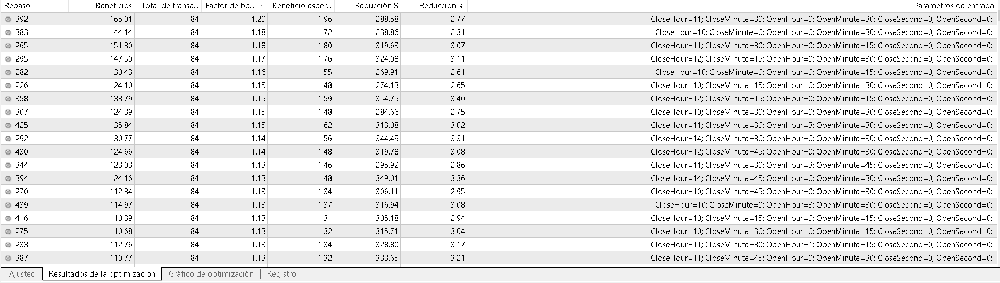

# EA_Swap

## Description
This automated investment strategy opens a position in a positive-swap forex pair before the end of wednesday session, and closes that position at the beginning of next session.

## Profit / Loss Theory
On the one hand, we have a loss caused by the spread and broker commission. 
We also have random probabilities of the price going against or in our favor during that small period of time.

On the other hand, we have a profit due to the triple rollover made on wednesday at 17:04:01 (New York time)

In conclusion, this EA is profitable if (3*swap > commission + spread) == true and variance is small enough.
If variance is too big, results will be random and not based on statistics and probability.

## Optimization and backtest
We'll be using the asset AUDCHF on M1 timeframe.

### Round 1
We make a general optimization to get an idea of what is the best time to open and close the position.
We'll be backtesting from 2018/01/02 to 2019/08/09 (1 year and 8 months) using a lot of different variables' values combination. Estimated time: 2 hours and 40 minutes
We are going to optimize the following variables:
* OpenHour 
* OpenMinute 
* CloseHour 
* CloseMinute 
So, we open our position at "16 hours - OpenHour" and "59 min - OpenMinute" 
and we close that position at "17 hours + CloseHour" and "04 min + CloseMin".

Example:
If all the variables are set to 2, we'll open an order on wednesday at 14:57:00 and close it at 19:06:00 on the same day-

    
   

On that first basic optimization we see that if we buy at around 12-13 hours and we close the position at around 17:30 we'll have positive results.
However, this is a very general analysis so we'll have to go deeper in order to get reliable results.

### Round 2
We make a deeper backtest analysis based on the previous results.

## Disclaimer
This code is disclosed publicly for educational purposes only.
It is expected that this EA has a low scalability and may have divergence due to lower liquidity and bigger spreads in the foreign exchange markets at open/close times. There may also be differences between backtests/demo and live accounts due to slippage. The swap used in the backtest is the actual swap and not the historic one, so results can't be considered. 
Use at your own risk. I'm not responsible for any financial loss or damage caused by the use of this software.

